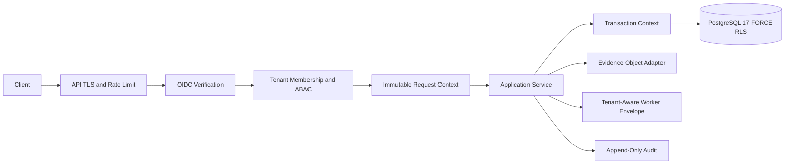

# Step 12 Architecture

```mermaid
flowchart LR
 C[Client] --> G[API TLS and Rate Limit]
 G --> I[OIDC Verification]
 I --> M[Tenant Membership and ABAC]
 M --> X[Immutable Request Context]
 X --> S[Application Service]
 S --> T[Transaction Context]
 T --> P[(PostgreSQL 17 FORCE RLS)]
 S --> E[Evidence Object Adapter]
 S --> Q[Tenant-Aware Worker Envelope]
 S --> A[Append-Only Audit]
```

The baseline is a modular monolith plus workers and PostgreSQL. Extra infrastructure requires workload evidence and ADR approval.
